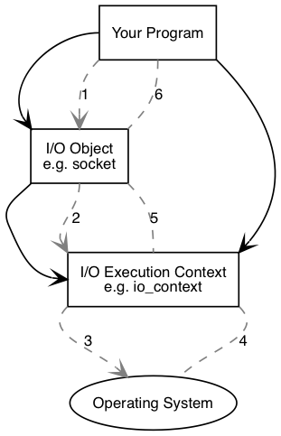
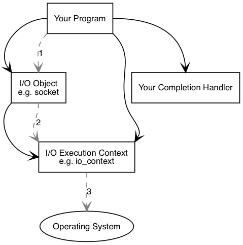

# Boost.Asio

## 背景

大部分程序都需要与外界交互,可能通过文件、网络、或者串口.有时候,网络通信,单个i/o操作需要很长时间完成.这给应用程序开发带来了特殊的挑战.

Boost.Asio提供了管理这些耗时操作的工具,而不需要开发人员使用基于传统线程和显式锁的并发模型.

## 核心概念和功能

### Boost.Asio剖析
Boost.Asio可用来执行同步和异步操作,如socket上的i/o操作.接下来,我们通过一系列概念图来理解Boost.Asio是如何工作的.

##### 先来看一下执行同步连接时发生的操作:



你的程序需要至少有一个`io执行context`,它是一个`boost::asio::io_context`、`boost::asio::thread_pool`、或`boost::asio::system_context`对象.这个`io执行context`将作为代理连接操作系统提供的`io服务`.

```cpp
boost::asio::io_context io_context;
```

然后你的程序需要一个类似`tcp socket`的i/o对象来执行`i/o`操作.

```cpp
boost::asio::ip::tcp::socket socket(io_context);
```

##### 同步操作
执行了同步连接操作之后,下列事件会依次发生:

1. 调用`i/o对象`初始化连接操作

```cpp
socket.connect(server_endpoint);
```

2. `i/o`对象将操作交给`i/o执行context`
3. `i/o执行context`调用操作系统接口执行连接操作
4. 操作系统将`i/o`执行结果返回给`i/o执行context`
5. `i/o执行context`将操作的错误信息转换为`boost::system::error_code`. `error_code`可与特定值进行比较,或者测试其真值(`false`意味着没有错误).然后将执行结果传递回`i/o`对象.
6. 如果操作失败,`i/o`对象抛出`boost::system::system_error`异常.如果操作以下面接口调用:

```cpp
boost::system::error_code ec;
socket.connect(server_endpoint, ec);
```

那么则不会抛出异常,并且`ec`被设置为操作结果.


##### 异步操作

执行了`异步操作`之后,将发生以下事件:



1. 调用`i/o对象`初始化连接操作

```cpp
socket.async_connect(server_endpoint, your_completion_handler);
```

其中`your_completion_handler`有以下签名:

```cpp
void your_completion_handler(const boost::system::error_code& ec);
```

执行不同异步操作的完成函数有不同的签名.

2. `i/o`对象将操作交给`i/o执行context`
3. `i/o执行context`通知操作系统需要执行异步连接.
时间流逝(在同步操作里,这个时间包含连接操作的全部时间).


4. 操作系统通过将执行结果放入一个队列来指示操作完成.这个结果可以被`i/o执行context`取出.
5. 当使用`io_context`作为`i/o执行context`时,你的程序必须调用`io_context::run`(或者其它类似的成员函数)以检索结果.`io_context::run`在有未完成的异步操作时会一直阻塞,所以你可以在开始第一个异步操作后就调用它.
6. 在`io_context::run`内部,`i/o执行context`获取操作结果,将其转化为`error_code`,然后传递给异步完成回调函数.


### `Proactor`模式:不使用线程的并发

##### `Proactor`和`Boost`

我们先看一下`Proactor`设计模式在`Boost.Asio`中的实现,其中不包含任何特定平台的细节:


##### `Proactor模式`:

+ 异步操作(Asynchronous Operation)

定义异步操作,比如:socket上的异步读/写.

+ 异步操作处理器(Asynchronous Operation Processor)

执行异步操作并在操作完成时向异步事件完成队列中存入完成事件.从高层视角来看,内部服务如`reactive_socket_service`是异步操作处理器

+ 事件完成队列(Completion Event Queue)

缓存完成事件,直到异步事件分发器从中取出事件.

+ 完成处理句柄(Completion Handler)

处理异步操作结果.这些函数对象通常使用`boost::bind`创建.

+ 异步事件解复用器(Asynchronous Event Demultiplexer)

阻塞直到完成事件队列有事件,然后将完成事件传递给调用者.

+ Proactor

调用异步事件解复用器来读取事件,然后将其分发给相关事件的完成处理句柄(比如.调用函数对象).这是`io_context`类所代表的抽象.

+ 初始化

应用程序通过高层的接口如`basic_stream_socket`启动特定的异步操作,这个接口将其代理给`reactive_socket_service`.

##### 使用`Reactor`来实现

在很多平台上,`Boost.Asio`使用`Reactor`来实现`Proactor`模式,这些`Reactor`可能是`select`,`epoll`或`kqueue`

+ 异步操作处理

`reactor`使用`select`,`epoll`或者`kqueue`实现.当`reactor`表明资源已经就绪,处理器执行异步操作并将相关的完成处理函数加入完成事件队列中.

+ 完成事件队列

完成处理句柄(如函数对象)的链表.

+ 异步事件分发器

通过事件或条件变量在完成事件队列上等待完成句柄可用.

##### 在windows上使用`overlapped I/O`

##### 优势

+ 可移植
  由`Boost.Asio`选择最合适的异步机制,如Windows上使用原生的异步I/O api,而在POSIX上使用`epoll`、`select`.
+ 并发与线程解耦
  长时间的操作可以异步执行,因此程序不需要通过创建大量线程来提高并发度.
+ 高性能和可扩展
  使用异步操作有可能通过减少线程数量来避免过多的上下文切换开销,数据间同步和移动.
+ 简化同步
  异步处理可以在一个线程中完成,应用程序逻辑可以较少的关注同步问题.
+ 函数组合
  函数组合是指实现一个高层次操作的的函数,如以特定格式发送一个消息.每个函数都有可能多次调用底层读/写操作来实现.
  比如,考虑如下一个协议:每条消息由一个定长的消息头和一个可变的消息体构成.消息体的长度在消息头中指定.一个可能的`read_message`操作可以使用两次低级`read`实现,第一次用于接收消息头并获取长度,第二次接收整个消息体.
  可以用异步方式组合函数功能,异步操作可以进行链式连接.一个操作完成后可以初始化下一步操作.通过将这些操作封装到首次操作中,调用者感受不到高层操作是通过异步调用链实现的.

  通过组合操作的能力,可以更容易开发具有高级抽象的网络库,用于支持特定的协议.
#### 劣势

+ 编程复杂
  由于异步操作的初始化和完成在时间和空间上是分散的,因此编程更为复杂.另外,由于控制流的颠倒,应用程序的调试也会变得困难.
+ 内存开销
  缓冲区必须持续存在于读/写操作期间,这可能会持续不确定的时间,另外每次并发操作都需要单独的缓冲区.而`Reactor`模式,在socket就绪前不需要缓冲区用于读或写.


### 线程和`Boost.Asio`

##### 线程安全

通常,并发地使用不同对象是安全的,但是并发地使用同一个对象是不安全的.但是,`io_context`提供了强保证,并发地使用其单一对象是安全的.

##### 线程池

可以让多个线程调用`io_context::run`来使用线程池执行完成事件.这种方法还可以与`post()`方法一起使用作为在线程池间执行任意计算任务的方法.
注意所有调用`io_context::run`的线程是等价的,`io_context`可能以任意顺序分配任务.

##### 内部线程

库的内部实现可能使用内部线程来模拟异步.这些线程应该尽可能地对用户不可见.另外,这些线程必须做到:

+ 不直接调用用户代码
+ 必须阻塞所有信号

这一方法得到了以下保证:

+ 异步完成处理函数只在调用`io_context::run`的线程中调用

因此,库的使用者有责任创建和管理所有线程及通知由哪个线程处理.

这种设计的原因有:

+ 通过在唯一的线程中调用`io_context::run()`,用户代码可以避免同步的复杂性.
+ 库的使用者可能需要在线程启动时执行一些初始化操作.如`COM`的`CoInitializeEx`
+ 库的接口与线程创建和管理接口解耦,允许在不支持线程的平台上执行.


### Stands: 在线程中使用无锁操作

`strand`被定义为严格地按顺序执行事件的处理函数.使用`strand`允许在多线程程序中执行代码而不需要显式的使用锁(比如,使用mutexes).

`strand`可以显式或隐式的使用,下面描述了几种方式:

+ 在唯一的线程中调用`io_context::run()`,这样所有的事件处理操作会隐式的串行执行,因为`io_context`保证所有的操作都在`run()`中执行.
+ 同一个`connection`上关联的异步操作链(eg.一个半双工HTTP实现),异步操作不可能并发地执行.这也是隐式的`strand`.
+ 显式的`strand`是一个`strand<>`或`io_context::strand`的实例.所有的事件函数对象需要通过使用`boost::asio::bind_executor()`绑定到`strand`,或者通过`strand`对象的`posted/dispatched`方法.

在组合异步操作的情况下,比如`async_read()`或`async_read_until()`,如果完成handler使用了`strand`,那么所有的间接操作也需要使用同样的`strand`.这是为了保证所有调用者和组合操作之间共享的任意对象的访问是线程安全的.(比如在socket上使用async_read,调用者可以进行`close`操作).

为了达到这种效果,所有的异步操作可以通过`get_associated_executor`函数来获取`handler`相关的`executor`.比如:

```cpp
boost::asio::associated_executor_t<Handler> a = boost::asio::get_associated_executor(h);
```

相关的`executor`必须满足`Executor`的要求.它将被异步操作用来提交执行间接或者最后的`handlers`.
`executor`可以被特定的handler进行定制化,通过指定一个内嵌的type `executor_type`和成员函数`get_executor()`:

```cpp
class my_handler
{
public:
  // Custom implementation of Executor type requirements.
  typedef my_executor executor_type;

  // Return a custom executor implementation.
  executor_type get_executor() const noexcept
  {
    return my_executor();
  }

  void operator()() { ... }
};
```

对于更复杂的情况,可以直接定制化`associated_executor`模板:

```cpp
struct my_handler
{
  void operator()() { ... }
};

namespace boost { namespace asio {

  template <class Executor>
  struct associated_executor<my_handler, Executor>
  {
    // Custom implementation of Executor type requirements.
    typedef my_executor type;

    // Return a custom executor implementation.
    static type get(const my_handler&,
        const Executor& = Executor()) noexcept
    {
      return my_executor();
    }
  };

} } // namespace boost::asio
```

`boost::asio::bind_executor()`函数可以用来帮助绑定一个指定的`executor`对象,比如一个`strand`到完成handler.这种绑定自动关联一个上面展示的`executor`.比如,为了绑定一个`strand`我们可以像下面这样:

```cpp
my_socket.async_read_some(my_buffer,
    boost::asio::bind_executor(my_strand,
      [](error_code ec, size_t length)
      {
        // ...
      }));
```

### Buffers

从根本上讲,I/O涉及数据传递和连续的内存区域,被称为`buffers`.这些`buffers`可以简单地表述为一个指针和长度构成的元组.然而,为了开发高效的网络应用,`Boost.Asio`提示了`scatter-gather`操作.这些操作涉及一个或多个buffers:

+ 分散(scatter)读将数据读到多个buffers
+ 聚集(gather)写将多个buffers的数据传递出去

这样,我们需要一个抽象来表示buffer的集合.`Boost.Asio`定义了一个类型用来表示一个单独的buffer,它可以被存在在一个容器中,它可以被传递给`scatter-gather`操作.

```cpp
typedef std::pair<void*, std::size_t> mutable_buffer;
typedef std::pair<const void*, std::size_t> const_buffer;
```